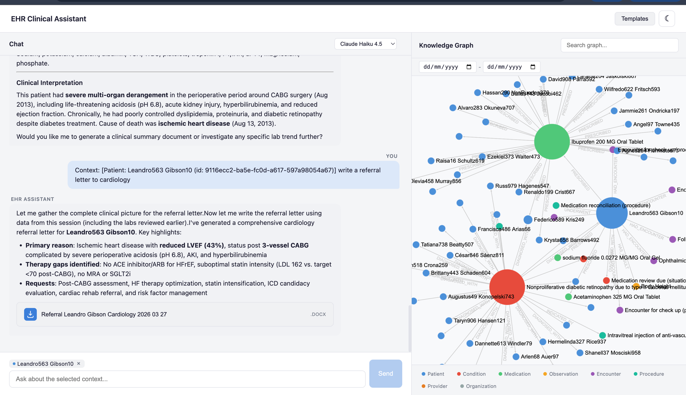

# EHR-Clinical-Assistant

Thesis experiment testing whether **graph-based retrieval improves LLM clinical question answering** compared to SQL and LLM-only baselines — across both proprietary and open-source models.

EHR-Clinical-Assistant is a [Brainifai](https://github.com/anagnole/brainifai) child instance — a specialized node with a custom EHR template, its own graph schema, custom context-building MCP tools, and an evaluation harness. It includes a doctor-facing clinical assistant UI with a knowledge graph visualizer.

[](https://youtu.be/X7BhfGabk70)
> **[Watch the demo video](https://youtu.be/X7BhfGabk70)** — Clinical chat with graph-based retrieval, document generation, and multi-model support.

## Architecture

```
Synthea (2000+ patients, seed 42)
        │
        ▼
┌───────────────┐     ┌────────────────┐
│  CSV Parser    │────▶│  JSON Snapshot  │
│  src/generate  │     │  data/generated │
└───────────────┘     └────────┬───────┘
                               │
              ┌────────────────┼────────────────┐
              ▼                ▼                 ▼
     ┌──────────────┐  ┌─────────────┐  ┌──────────────┐
     │  Kuzu Graph   │  │ PostgreSQL  │  │  LLM-Only    │
     │  .brainifai/  │  │  Docker     │  │  (no retrieval)│
     │  data/kuzu    │  │  port 5432  │  │              │
     └──────┬───────┘  └──────┬──────┘  └──────┬───────┘
            │                 │                 │
            ▼                 ▼                 ▼
     ┌──────────────────────────────────────────────┐
     │     Evaluation Harness (80 questions)         │
     │  4 systems × 5 question types × N models      │
     │  Claude (MCP) | Ollama (native tool calling)  │
     └──────────────────────────────────────────────┘
            │
            ▼
     ┌──────────────────────────────────────────────┐
     │         Doctor-Facing Clinical UI              │
     │  Streaming chat + Sigma.js knowledge graph     │
     │  Model selector (Claude / Ollama)              │
     └──────────────────────────────────────────────┘
```

## Multi-Model Support

The system supports both proprietary and open-source models through a unified provider abstraction ([`@anagnole/claude-cli-wrapper`](https://github.com/anagnole/claude-cli)):

| Provider | Models | Tool Calling | How |
|----------|--------|-------------|-----|
| **Claude** (via CLI) | claude-sonnet-4-6, claude-opus-4-6 | MCP tools | Claude CLI subprocess |
| **Ollama** (local) | qwen2.5:32b, mistral-small, etc. | Native function calling | Ollama HTTP API + agent loop |

Both providers have access to the same 6 EHR tools querying the same Kuzu graph database. Claude uses MCP; Ollama models use native tool calling with direct Kuzu queries.

## Graph Schema

**7 node tables:** Patient, Encounter, ConceptCondition, ConceptMedication, ConceptObservation, ConceptProcedure, Provider

**12 relationships:** DIAGNOSED_WITH, PRESCRIBED, HAS_RESULT, UNDERWENT, HAD_ENCOUNTER, TREATED_BY, AT_ORGANIZATION, TREATS, COMPLICATION_OF, and more

FTS indexes on patient names, condition descriptions, medication names, and observation descriptions.

## Question Types

| Type | Description | Count |
|------|-------------|-------|
| **simple-lookup** | Direct fact retrieval (e.g., "What medications is patient X on?") | 16 |
| **multi-hop** | Requires traversing multiple relationships | 16 |
| **temporal** | Time-based reasoning (e.g., "Was drug X started before condition Y?") | 16 |
| **cohort** | Population-level queries (e.g., "How many diabetic patients are on metformin?") | 16 |
| **reasoning** | Clinical inference from retrieved data | 16 |

80 questions curated from 244 candidates, stratified across clinical domains with deterministic selection.

## Prerequisites

- **Node.js** >= 18
- **Docker** (for PostgreSQL baseline)
- **Synthea** CSV output in `data/synthea/` (seed 42, 2000+ alive patients)
- **Claude CLI** installed (for Claude model evaluation and MCP tools)
- **Ollama** installed (for open-source model evaluation) — `brew install ollama`

## Setup

```bash
# Install dependencies
npm install

# Start PostgreSQL (baseline)
npm run pg:up

# Pull an Ollama model (optional, for open-source benchmarks)
ollama pull qwen2.5:32b
```

## Pipeline

The pipeline runs in order: generate → ingest → verify → evaluate.

### 1. Generate synthetic data & questions

Parses Synthea CSVs, profiles the dataset, generates 244 candidate questions, curates 80 for evaluation, and writes JSON snapshots to `data/generated/`.

```bash
npm run generate
```

**Outputs:** `patients.json`, `providers.json`, `ground-truth.json`, `evaluation-questions.json`, `stats.json`

### 2. Ingest into databases

```bash
# Ingest into Kuzu graph
npm run ingest

# Ingest into PostgreSQL
npm run pg:ingest
```

### 3. Verify data integrity

```bash
# Verify Kuzu graph (node counts, relationships, FTS, sample patients)
npm run verify

# Verify PostgreSQL tables
npm run pg:verify

# Verify prompt builder output
npm run prompt:verify
```

### 4. Run evaluation

Runs all 80 questions against 4 systems, scores answers, and generates reports. Supports any model available through the provider registry.

```bash
# Run with Claude (default)
npm run eval

# Run with an Ollama model
npm run eval -- --model qwen2.5:32b

# Run specific system + model
npm run eval -- --model qwen2.5:32b --system graph --limit 5

# Quick sample across all question types
npm run eval -- --model qwen2.5:32b --sample 10
```

Each model gets its own results file (`results/incremental-<model>.json`), so runs don't overwrite each other. Use `--resume` to continue interrupted runs.

**Outputs in `results/`:**
- `summary.md` — Overall and per-type/domain score tables
- `summary.json` — Structured results with per-question detail
- `per-question.csv` — Flat export for analysis

## Clinical Assistant UI

A doctor-facing web interface with streaming chat and an interactive knowledge graph.

```bash
# Development (hot reload)
npm run ui:dev

# Production build
npm run ui
```

Features:
- **Model selector** — switch between Claude and Ollama models
- **Streaming chat** — real-time responses with tool call visibility
- **Knowledge graph** — Sigma.js force-directed graph visualization
- **Node interaction** — click nodes to explore, add as context to queries
- **Context chips** — attach graph nodes to messages for focused queries
- **Date filtering** — filter clinical data by time range
- **Document generation** — generate referral letters, SOAP notes, reports
- **Clinical templates** — pre-built document templates

## MCP Server

ThesisBrainifai exposes 7 clinical retrieval tools via MCP:

| Tool | Description |
|------|-------------|
| `search_patients` | Find patients by name or demographics |
| `get_patient_summary` | Full patient overview (conditions, meds, labs) |
| `get_diagnoses` | Active and historical diagnoses |
| `get_medications` | Current and past medications |
| `get_labs` | Lab results and observations |
| `get_temporal_relation` | Temporal relationships between clinical events |
| `find_cohort` | Find patient groups matching clinical criteria |

```bash
# Start the MCP server
./start-mcp.sh
```

## Preliminary Results

| System | Score | Avg Latency | Errors |
|--------|-------|-------------|--------|
| **graph** | **80.7%** | 12,213ms | 0 |
| sql | 76.0% | 4,766ms | 0 |
| sql-fts | 76.0% | 4,843ms | 0 |
| llm-only | 76.0% | 4,950ms | 0 |

> Only simple-lookup questions with Claude evaluated so far. Multi-hop, temporal, cohort, reasoning types and open-source model comparisons pending.

## Project Structure

```
├── data/
│   ├── synthea/          # Raw Synthea CSV output (gitignored)
│   ├── generated/        # JSON snapshots (gitignored)
│   ├── documents/        # Generated clinical documents
│   └── templates/        # Document templates
├── docs/
│   ├── plan.md           # Implementation plan
│   ├── phases/           # Phase specs (1-6)
│   └── tickets/          # 41 implementation tickets
├── results/              # Evaluation output (per-model)
├── src/
│   ├── generate.ts       # Entry: parse CSVs → generate questions
│   ├── ingest.ts         # Entry: load JSON → Kuzu graph
│   ├── verify.ts         # Entry: round-trip data verification
│   ├── snapshot.ts       # Write generated data to JSON
│   ├── curate.ts         # Select 80 questions from candidates
│   ├── parser/           # Synthea CSV reader
│   ├── questions/        # Question generators (5 types)
│   ├── prompt/           # LLM-only prompt builder
│   ├── sql/              # PostgreSQL schema, ingestion, adapters
│   ├── eval/             # Evaluation runner, scorer, report
│   ├── api/              # Fastify API server, Kuzu client, tools
│   └── ui/               # React + Sigma.js clinical assistant UI
├── docker-compose.yml    # PostgreSQL 16
├── start-mcp.sh          # MCP server launcher
└── package.json
```

## Tech Stack

- **TypeScript** with tsx for execution
- **Kuzu** — Embedded graph database for EHR data
- **PostgreSQL 16** — Relational baseline (standard + FTS)
- **[@anagnole/claude-cli-wrapper](https://github.com/anagnole/claude-cli)** — Unified provider abstraction (Claude CLI + Ollama)
- **Ollama** — Local open-source model inference
- **MCP** — Model Context Protocol for tool-based retrieval
- **Fastify** — API server with WebSocket support
- **React + Sigma.js** — Clinical assistant UI with graph visualization
- **Vite** — Frontend build and dev server
- **Synthea** — Synthetic patient data generation
